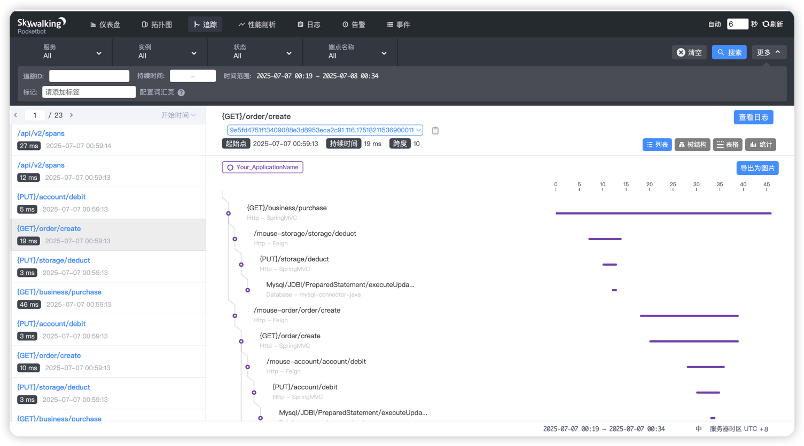
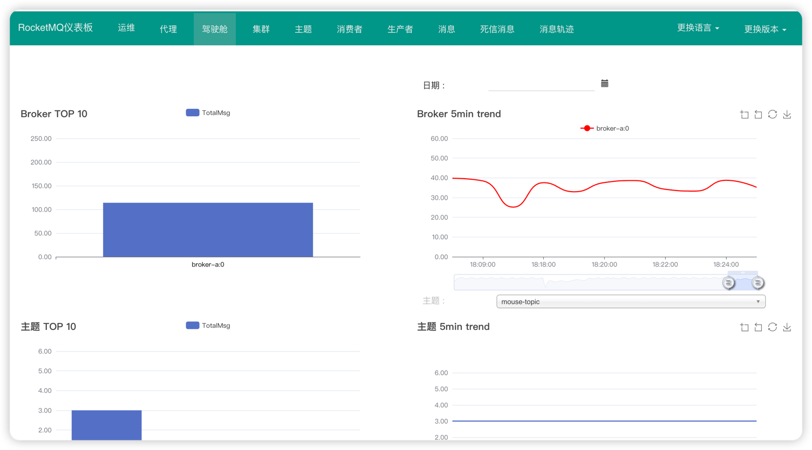
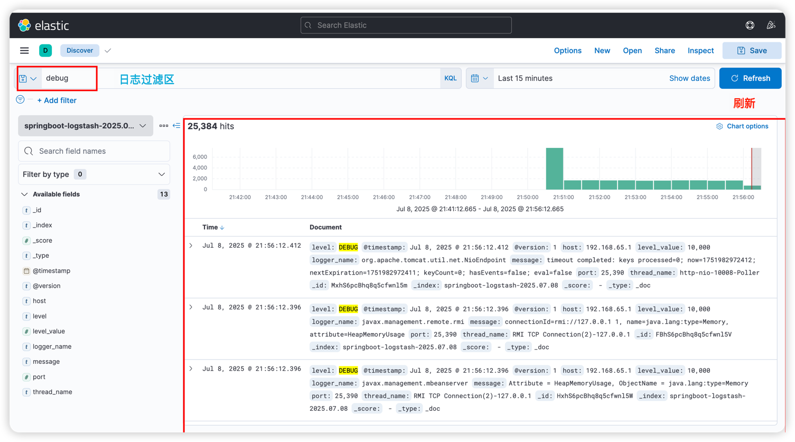
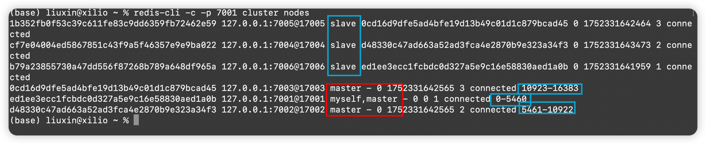

# 🐭mouse-cloud 微服务&分布式全家桶
- Spring Cloud v2021.0.4
- Spring Cloud Alibaba v2021.0.4.0
- Spring Cloud Gateway
- Spring Boot v2.7.15
- Zipkin + Sleuth
- Nacos v2.2.0
- Seata v2.3.0
- Skywalking v8.7.0
- RocketMQ v5.3.1
- ElasticSearch v7.17.28
- Kibana v7.17.28
- Logstash v7.17.28
- Canal v1.1.8
- Dubbo
- Redis 7.2.7
- Zookeeper v3.9.3

## 整合Nacos
- [点击查看详细文档](document/nacos/nacos.md)

## 整合链路追踪

### 方案一：整合zipkin（侵入式）
- [点击查看详细文档](document/zipkin/zipkin.md)

### 方案二：整合Skywalking（功能强大且非侵入式）
- [点击查看详细文档](document/skywalking/skywalking.md)

## 整合Seata
- [点击查看详细文档](document/seata/seata.md)

## 整合RocketMQ
- [点击查看详细入门文档](document/rocketmq/快速入门.md)
- [点击查看代码案例](mouse-rocketmq)

## 整合ELK
- [点击查看详细文档](document/elk/ELK.md)

## 整合Canal
- [点击查看详细文档](document/canal/canal.md)

## 整合Dubbo

## 整合RocketMQ
- [点击查看详细入门文档](document/rocketmq/%E5%BF%AB%E9%80%9F%E5%85%A5%E9%97%A8.md)
- [代码案例](mouse-rocketmq)

# 整个Redis
- [点击查看Redis-Cluster高可用集群搭建](document/redis/Redis-Cluster%E9%AB%98%E5%8F%AF%E7%94%A8%E9%9B%86%E7%BE%A4%E6%90%AD%E5%BB%BA.md)

## 整合Zookeeper
- [点击查看Zookeeper集群环境搭建](document/zookeeper/zookeeper%E9%9B%86%E7%BE%A4%E7%8E%AF%E5%A2%83%E6%90%AD%E5%BB%BA.md)
