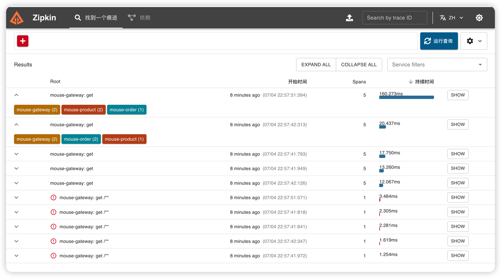
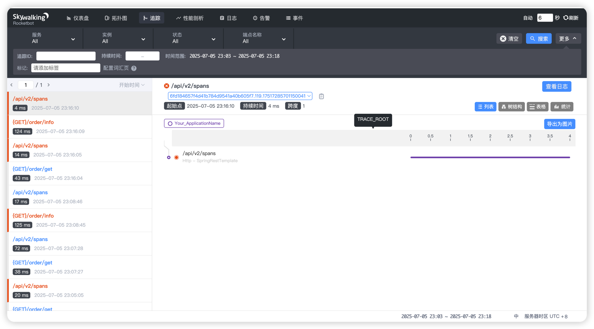
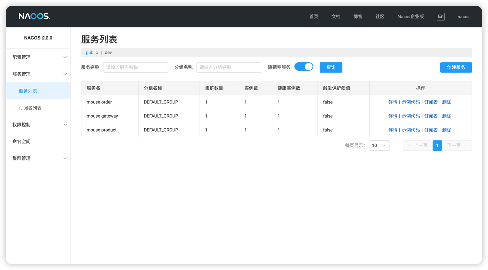

# mouse-cloud

- Spring Cloud
- Spring Cloud Alibaba
- Spring Cloud Gateway
- Zipkin + Sleuth
- Nacos

## 整合Nacos

启动单机版nacos

```shell
./startup.sh -m standalone
```

## 链路追踪

### 方案一：整合zipkin（侵入式）
[点击查看详细文档](document/zipkin/zipkin.md)


### 方案二：整合Skywalking（功能强大且非侵入式）
[点击查看详细文档](document/skywalking/skywalking.md)

## 整合nacos


