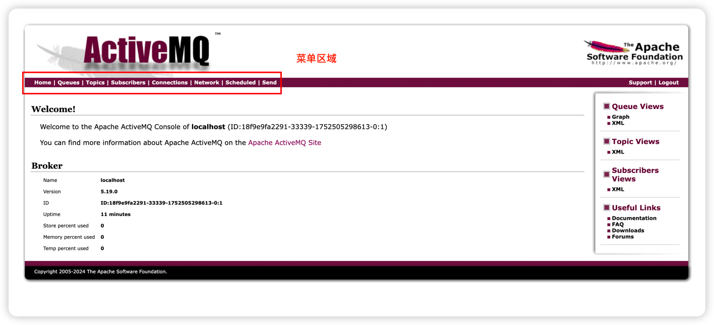

## 介绍

版本说明：activemq `v5.19.0`
## Docker安装单机版activemq
```shell
docker run -p 61616:61616 -p 8161:8161 apache/activemq-classic:5.19.0 
```
浏览器访问：`http://localhost:8161` 管理界面，用户名和密码默认都是`admin`


## SpringBoot整合ActiveMQ
引入依赖,注意客户端版本，如果版本不对需要替换客户端
```xml
<dependency>
    <groupId>org.springframework.boot</groupId>
    <artifactId>spring-boot-starter-activemq</artifactId>
</dependency>
```
application.yml添加如下配置：
```yaml
spring:
  activemq:
    broker-url: tcp://localhost:61616
    user: admin
    password: admin
    in-memory: false  # 禁用内存模式
    packages.trust-all: true  # 允许反序列化所有类
```
写个简单的生产者消费者案例：
```java
@SpringBootApplication
public class ActiveMQApplication implements CommandLineRunner {
    @Autowired
    private JmsTemplate jmsTemplate;
    public static void main(String[] args) {
        SpringApplication.run(ActiveMQApplication.class, args);
    }
    @Override
    public void run(String... args) {
        //发送一条消息
        jmsTemplate.convertAndSend("test-queue", "Hello ActiveMQ");
    }
    //消费者
    @Component
    class MessageConsumer {
        @JmsListener(destination = "test-queue")
        public void receive(String message) {
            System.out.println("接收到的消息: " + message);
        }
    }
}
```
启动项目正常会在控制台打印接收到的消息，可去管理界面查看`Queues`菜单是否有`test-queue`队列生成～
## 参考文献
- [官方安装文档](https://activemq.apache.org/components/classic/documentation/docker-image)
