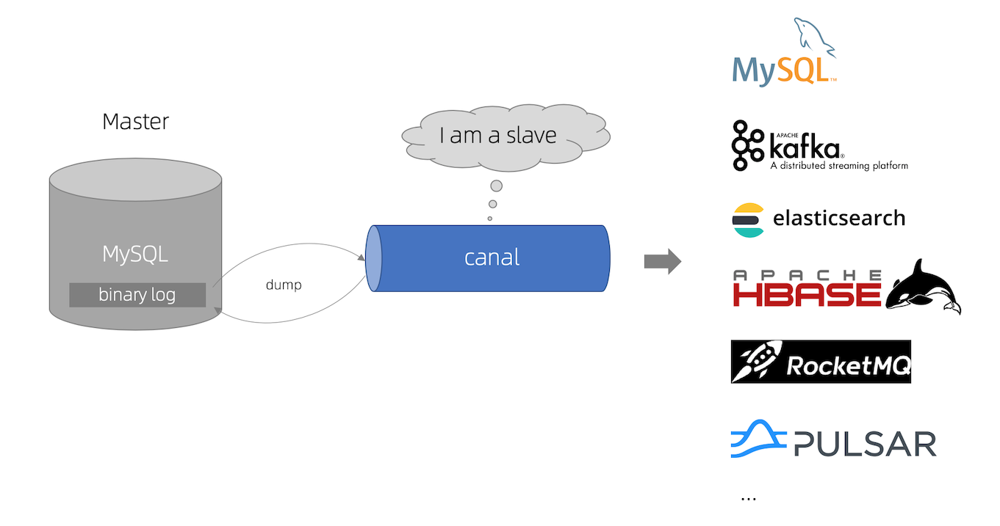

# 前言 


版本：`canal v1.1.8`
## 相关资源
- [canal v1.1.8下载](https://github.com/alibaba/canal/releases/tag/canal-1.1.8)
- [canal wiki官方文档](https://github.com/alibaba/canal/wiki)
## 安装Canal Server
1. 准备工作

- 查看是否已经开启了binglog,如果是ON表示已经开启，命令如下：
```shell
SHOW VARIABLES LIKE 'log_bin';
```
如果没有开启，需要修改my.cnf配置文件
```properties
[mysqld]
log-bin=mysql-bin # 开启 binlog
binlog-format=ROW # 选择 ROW 模式
server_id=1 # 配置 MySQL replaction 需要定义，不要和 canal 的 slaveId 重复
```

- 授权canal连接MySQL账号具有作为MySQL`slave`的权限(如果没有权限会出现[错误](example.log)), 如果已有slave权限账户可直接用，不需要再创建。
```shell
CREATE USER canal IDENTIFIED BY 'canal';  
GRANT SELECT, REPLICATION SLAVE, REPLICATION CLIENT ON *.* TO 'canal'@'%';
-- GRANT ALL PRIVILEGES ON *.* TO 'canal'@'%' ;
FLUSH PRIVILEGES;
```
2. 修改canal的配置
```shell
vim conf/example/instance.properties
```
```properties
## mysql serverId
canal.instance.mysql.slaveId = 1234
#position info，需要改成自己的数据库信息
canal.instance.master.address = 127.0.0.1:3306 
canal.instance.master.journal.name = 
canal.instance.master.position = 
canal.instance.master.timestamp = 
#canal.instance.standby.address = 
#canal.instance.standby.journal.name =
#canal.instance.standby.position = 
#canal.instance.standby.timestamp = 
#username/password，需要改成自己的数据库信息
canal.instance.dbUsername = canal  
canal.instance.dbPassword = canal
canal.instance.defaultDatabaseName =
canal.instance.connectionCharset = UTF-8
#table regex
canal.instance.filter.regex = .\*\\\\..\*
```
- canal.instance.connectionCharset 代表数据库的编码方式对应到 java 中的编码类型，比如 UTF-8，GBK , ISO-8859-1
- 如果系统是1个 cpu，需要将 canal.instance.parser.parallel 设置为 false

3. 启动canal服务
```shell
sh bin/startup.sh
```
4. 查看是否已经启动成功，如果没有任何报错表示成功，需要查看下面两个日志文件
```shell
cat logs/canal/canal.log
cat logs/example/example.log
```
## 在maven项目中整合
1. 引入客户端依赖
```xml
<dependency>
    <groupId>com.alibaba.otter</groupId>
    <artifactId>canal.client</artifactId>
    <version>1.1.8</version>
</dependency>
<dependency>
    <groupId>com.alibaba.otter</groupId>
    <artifactId>canal.protocol</artifactId>
    <version>1.1.8</version>
</dependency>
```
2. 编写监听代码
>提示：有时官方文档都是比较新或者没有更新，建议下载`对应版本`的源码学习，里面有案例代码。
```java
import java.net.InetSocketAddress;
import java.util.List;
import com.alibaba.otter.canal.client.CanalConnectors;
import com.alibaba.otter.canal.client.CanalConnector;
import com.alibaba.otter.canal.common.utils.AddressUtils;
import com.alibaba.otter.canal.protocol.Message;
import com.alibaba.otter.canal.protocol.CanalEntry.Column;
import com.alibaba.otter.canal.protocol.CanalEntry.Entry;
import com.alibaba.otter.canal.protocol.CanalEntry.EntryType;
import com.alibaba.otter.canal.protocol.CanalEntry.EventType;
import com.alibaba.otter.canal.protocol.CanalEntry.RowChange;
import com.alibaba.otter.canal.protocol.CanalEntry.RowData;
public class SimpleCanalClientExample {
    public static void main(String args[]) {
        // 创建连接
        CanalConnector connector = CanalConnectors.newSingleConnector(new InetSocketAddress(AddressUtils.getHostIp(), 11111), "example", "", "");
        int batchSize = 1000;
        int emptyCount = 0;
        try {
            connector.connect();
            connector.subscribe(".*\\..*");
            connector.rollback();
            int totalEmptyCount = 120;
            while (emptyCount < totalEmptyCount) {
                Message message = connector.getWithoutAck(batchSize); // 获取指定数量的数据
                long batchId = message.getId();
                int size = message.getEntries().size();
                if (batchId == -1 || size == 0) {
                    emptyCount++;
                    System.out.println("empty count : " + emptyCount);
                    try {
                        Thread.sleep(1000);
                    } catch (InterruptedException e) {
                    }
                } else {
                    emptyCount = 0;
                    // System.out.printf("message[batchId=%s,size=%s] \n", batchId, size);
                    printEntry(message.getEntries());
                }
                connector.ack(batchId); // 提交确认
                // connector.rollback(batchId); // 处理失败, 回滚数据
            }
            System.out.println("empty too many times, exit");
        } finally {
            connector.disconnect();
        }
    }
    private static void printEntry(List<Entry> entrys) {
        for (Entry entry : entrys) {
            if (entry.getEntryType() == EntryType.TRANSACTIONBEGIN || entry.getEntryType() == EntryType.TRANSACTIONEND) {
                continue;
            }
            RowChange rowChage = null;
            try {
                rowChage = RowChange.parseFrom(entry.getStoreValue());
            } catch (Exception e) {
                throw new RuntimeException("ERROR ## parser of eromanga-event has an error , data:" + entry.toString(), e);
            }
            EventType eventType = rowChage.getEventType();
            System.out.println(String.format("================&gt; binlog[%s:%s] , name[%s,%s] , eventType : %s",
                    entry.getHeader().getLogfileName(), entry.getHeader().getLogfileOffset(),
                    entry.getHeader().getSchemaName(), entry.getHeader().getTableName(),
                    eventType));
            for (RowData rowData : rowChage.getRowDatasList()) {
                if (eventType == EventType.DELETE) {
                    printColumn(rowData.getBeforeColumnsList());
                } else if (eventType == EventType.INSERT) {
                    printColumn(rowData.getAfterColumnsList());
                } else {
                    System.out.println("-------&gt; before");
                    printColumn(rowData.getBeforeColumnsList());
                    System.out.println("-------&gt; after");
                    printColumn(rowData.getAfterColumnsList());
                }
            }
        }
    }
    private static void printColumn(List<Column> columns) {
        for (Column column : columns) {
            System.out.println(column.getName() + " : " + column.getValue() + "    update=" + column.getUpdated());
        }
    }
}
```
运行上述代码以后，如果没有任何错误信息表示连接成功，接下来在MySQL数据库中添加、更新数据，查看控制台的输出。

## 参考文档
- [canal官方快速入门文档](https://github.com/alibaba/canal/wiki/QuickStart)
