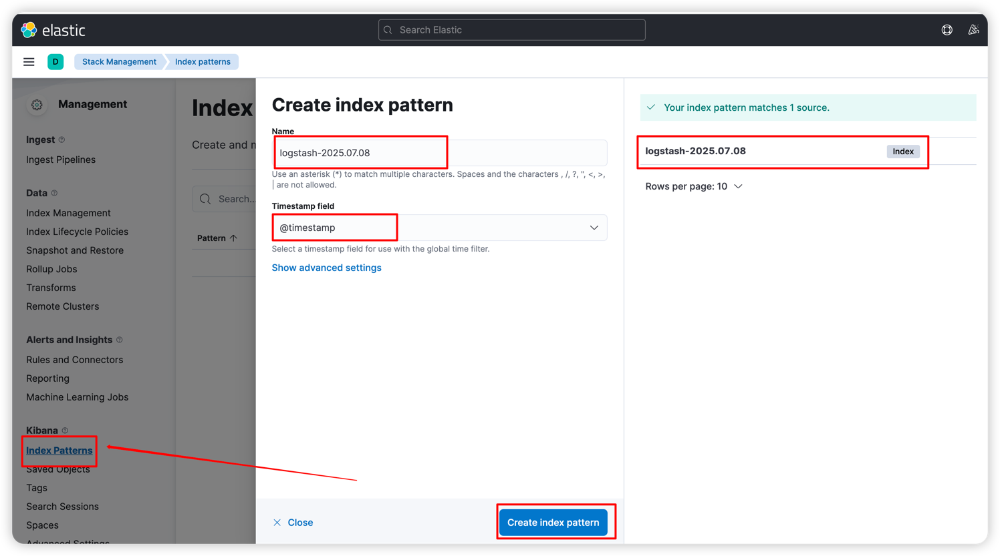
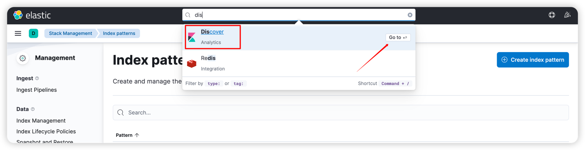

版本说明：

- ElasticSearch v7.17.28
- Kibana v7.17.28

## 相关资源

- [es v7.17.x版本文档](https://www.elastic.co/guide/en/elasticsearch/reference/7.17/getting-started.html)
- [logstash v7.17.x文档](https://www.elastic.co/guide/en/logstash/7.17/docker.html)
- [kibana v7.17.x文档](https://www.elastic.co/guide/en/kibana/7.17/docker.html)
- [es下载地址](https://www.elastic.co/downloads/elasticsearch)
- [kibana下载地址]()https://www.elastic.co/downloads/kibana

## docker安装ELK

创建一个elastic网络，让这三个组件都在同一个网络

```shell
docker network create elastic
```

### 安装单节点es

```shell

docker pull docker.elastic.co/elasticsearch/elasticsearch:7.17.28
docker run \
 --name elasticsearch \
 --net elastic \
 -p 127.0.0.1:9200:9200 \
 -p 127.0.0.1:9300:9300 \
 -e "discovery.type=single-node" \
 docker.elastic.co/elasticsearch/elasticsearch:7.17.28
```

注：安装多节点请查阅[官方文档](https://www.elastic.co/guide/en/elasticsearch/reference/7.17/docker.html)

### 安装kibana

```shell
docker pull docker.elastic.co/kibana/kibana:7.17.28
docker run \
 --name kibana \
 --net elastic \
 -p 127.0.0.1:5601:5601 \
 -e "ELASTICSEARCH_HOSTS=http://elasticsearch:9200" \
 docker.elastic.co/kibana/kibana:7.17.28
```

浏览器访问：`http://localhost:5601`


### 安装logstash

先在主机目录下`/home/admin/data/logstash`(自定义)新建一个文件`logstash.conf`
并添加如下内容，如果内容为空将会报错，这是一个坑（[error.log](error.log)）

````shell
 input {
  tcp {
    mode => "server"
    host => "0.0.0.0"
    port => 5044
    codec => json_lines
  }
}
output {
  elasticsearch {
    hosts => ["elasticsearch:9200"]
    index => "logstash-%{+YYYY.MM.dd}"
  }
  stdout { codec => rubydebug }
}
````

通过docker启动logstash服务

```shell
docker run  \
  --name logstash \
  -p 5044:5044 \
  --net elastic \
  -v /home/admin/data/logstash/logstash.conf:/usr/share/logstash/pipeline/logstash.conf \
  docker.elastic.co/logstash/logstash:7.17.28
```

## SprigBoot整合logstash实现日志收集

上面基础elk服务环境搭建成功以后，就可以将日志上报到**logstash**了，下面是Spring Boot项目上报日志案例。

### 引入核心依赖

```xml
<properties>
    <logback-classic.version>1.2.11</logback-classic.version>
    <logback-access.version>2.0.6</logback-access.version>
</properties>

<dependency>
    <groupId>net.logstash.logback</groupId>
    <artifactId>logstash-logback-encoder</artifactId>
    <version>7.1.1</version>
</dependency>
<dependency>
    <groupId>ch.qos.logback</groupId>
    <artifactId>logback-core</artifactId>
    <version>${logback-classic.version}</version>
</dependency>
<dependency>
    <groupId>ch.qos.logback</groupId>
    <artifactId>logback-classic</artifactId>
    <version>${logback-classic.version}</version>
</dependency>
<dependency>
    <groupId>ch.qos.logback.access</groupId>
    <artifactId>logback-access-common</artifactId>
    <version>${logback-access.version}</version>
</dependency>
```

### 日志上报配置

在项目**resource**目录下新建一个**logback.xml**文件并添加如下简单配置：

```xml
<?xml version="1.0" encoding="UTF-8"?>
<configuration>
    <appender name="stash" class="net.logstash.logback.appender.LogstashTcpSocketAppender">
        <destination>127.0.0.1:5044</destination>
        <!-- encoder is required -->
        <encoder class="net.logstash.logback.encoder.LogstashEncoder"/>
    </appender>

    <root level="all">
        <appender-ref ref="stash"/>
    </root>
</configuration>
```

> 5044是上面logstash服务的端口号。

至此环境环境和配置已完成，产生日志后，可以去**kibana**中的**Discovery**查看，查看过程如下：
1. 新建一个index pattern。

2. 搜索框输入Discovery打开

3. 查看日志

