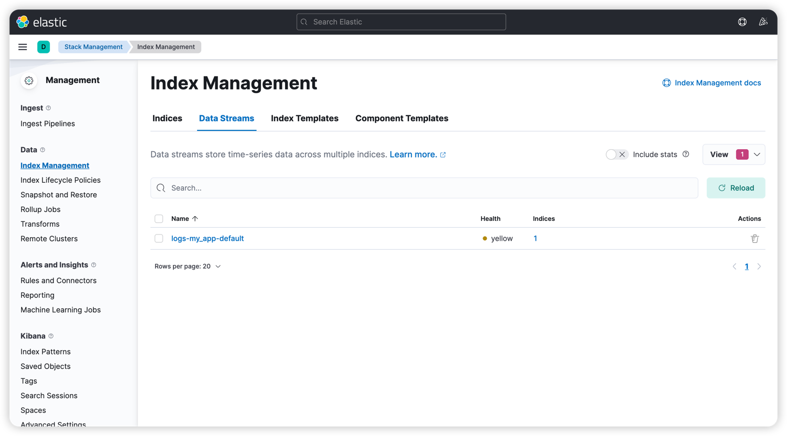

版本说明：
- ElasticSearch v7.7.28
- Kibana v7.7.28

## 资源下载
- [es v7.17.x版本文档](https://www.elastic.co/guide/en/elasticsearch/reference/7.17/getting-started.html)

## docker安装ELK
### 安装单节点es
```shell
docker network create elastic
docker pull docker.elastic.co/elasticsearch/elasticsearch:7.17.28
docker run --name es01-test --net elastic -p 127.0.0.1:9200:9200 -p 127.0.0.1:9300:9300 -e "discovery.type=single-node" docker.elastic.co/elasticsearch/elasticsearch:7.17.28
```
注：安装多节点请查阅[官方文档](https://www.elastic.co/guide/en/elasticsearch/reference/7.17/docker.html)
### 安装kibana
```shell
docker pull docker.elastic.co/kibana/kibana:7.17.28
docker run --name kib01-test --net elastic -p 127.0.0.1:5601:5601 -e "ELASTICSEARCH_HOSTS=http://es01-test:9200" docker.elastic.co/kibana/kibana:7.17.28
```
浏览器访问：`http://localhost:5601`

### 扩展
停止ES&kibana容器：
```shell
docker stop es01-test
docker stop kib01-test
```
删除容器和网络：
```shell
docker network rm elastic
docker rm es01-test
docker rm kib01-test
```

