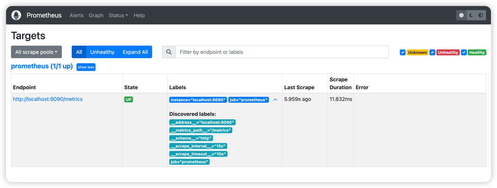

## 前言
Prometheus是一个开源系统监控和警报工具，用于将指标收集存储为时序数据并存储，通常会搭配一些图形化监控面板一起使用，用于图形化展示监控信息，例如grafana。
## Docker安装Prometheus

1. 运行容器
```shell
docker run -d \
    -p 9090:9090 \
    -v /home/docker/prometheus/prometheus.yml:/etc/prometheus/prometheus.yml \
    prom/prometheus
```
**特别说明**：`prometheus.yml`是核心的配置文件，在启动容器的时候如果该文件没有在主机创建或者内容有误都会导致`prometheus`服务启动失败！

2. 配置规则

编辑prometheus.yml文件添加如下配置：
```yaml
global:
  scrape_interval: 15s
  evaluation_interval: 15s
alerting:
  alertmanagers:
    - static_configs:
        - targets:
rule_files:
scrape_configs:
  - job_name: "prometheus"
    static_configs:
      - targets: [ "localhost:9090" ]
```
浏览器访问`http://localhost:9090`后打开一个界面，在顶部菜单栏选择Status-Targets会出现如下界面：

## 参考文档
- [Prometheus官方文档](https://prometheus.io/docs/introduction/overview/)
- [软件下载](https://prometheus.io/download/)
