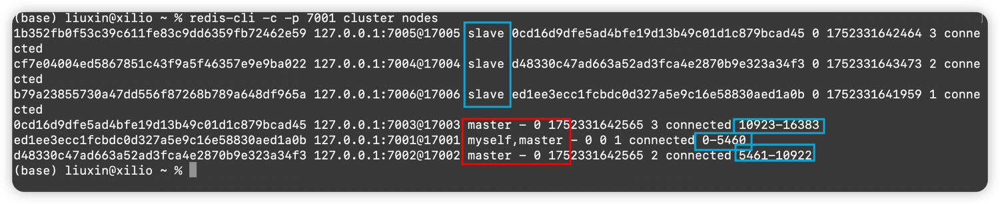

## 前言

本文介绍如何搭建官方推荐的`3主3从`高可用集群，也就是有3个master节点，每个master有3个副本。

- Redis版本：`v7.2.7`

## 在Mac OS上搭建集群

> 整个学习测试环境的搭建全部在同一台主机上
> 创建节点

Redis的安装

```shell
brew install redis@7.2.7 #也可直接brew install redis 安装最新版用于学习
```
## 创建节点脚本
需要分别创建6个节点
```shell
#!/bin/bash
for port in {7001..7006}; do
  mkdir -p $port/data
  cat > $port/redis.conf <<EOF
port $port
cluster-enabled yes
cluster-config-file nodes-$port.conf
cluster-node-timeout 5000
appendonly yes
EOF
done
```

启动所有redis节点服务

```shell
#!/bin/bash
for port in {7001..7006}; do
  redis-server $port/redis.conf &
done

```

查看对应的端口是否正常监听

```shell
root@xilio redis % spd 7001-7006   
redis-ser 13712 liuxin    7u  IPv4 0x209662860771443b      0t0  TCP *:7001 (LISTEN)
redis-ser 13712 liuxin    8u  IPv6 0x20966281442d58bb      0t0  TCP *:7001 (LISTEN)
redis-ser 13713 liuxin    7u  IPv4 0x209662860fae78c3      0t0  TCP *:7002 (LISTEN)
redis-ser 13713 liuxin    8u  IPv6 0x2096628141a220bb      0t0  TCP *:7002 (LISTEN)
redis-ser 13714 liuxin    7u  IPv4 0x20966286072f6d4b      0t0  TCP *:7003 (LISTEN)
redis-ser 13714 liuxin    8u  IPv6 0x20966281442d60bb      0t0  TCP *:7003 (LISTEN)
redis-ser 13715 liuxin    7u  IPv4 0x20966286076aa6a3      0t0  TCP *:7004 (LISTEN)
redis-ser 13715 liuxin    8u  IPv6 0x20966281442d68bb      0t0  TCP *:7004 (LISTEN)
redis-ser 13716 liuxin    7u  IPv4 0x2096628607761b2b      0t0  TCP *:7005 (LISTEN)
redis-ser 13716 liuxin    8u  IPv6 0x20966281442d70bb      0t0  TCP *:7005 (LISTEN)
redis-ser 13717 liuxin    7u  IPv4 0x20966286072f61d3      0t0  TCP *:7006 (LISTEN)
redis-ser 13717 liuxin    8u  IPv6 0x20966281442dd0bb      0t0  TCP *:7006 (LISTEN)
```

创建集群

```shell
#!/bin/bash
redis-cli --cluster create \
  127.0.0.1:7001 127.0.0.1:7002 127.0.0.1:7003 \
  127.0.0.1:7004 127.0.0.1:7005 127.0.0.1:7006 \
  --cluster-replicas 1 --cluster-yes
```

- cluster-yes: 强制创建集群,跳过确认，不用输入yes

控制台末尾打印类似如下日志表示集群创建成功

```shell
13715:S 12 Jul 2025 22:26:49.889 * Removing the history file appendonly.aof.1.incr.aof in the background
13715:S 12 Jul 2025 22:26:49.889 * Removing the history file appendonly.aof.1.base.rdb in the background
13715:S 12 Jul 2025 22:26:49.894 * Background AOF rewrite finished successfully
```
查看集群集群拓扑，可以查看
```shell
redis-cli -c -p <端口> cluster nodes
```


查看集群详细信息，可以看节点有多少key

```shell
redis-cli --cluster info 127.0.0.1:7001
```


查看单个集群节点详细信息
```shell
redis-cli -p <端口> info replication
```


停止所有Redis服务脚本
```shell
#!/bin/bash

# 删除所有节点的数据文件
for port in {7001..7006}; do
  rm -f $port/{nodes.conf,dump.rdb,appendonly.aof}
done

# 终止7000-7005端口的进程
for port in {7001..7006}; do
  echo "正在查找端口 $port 的进程..."
  # 使用 lsof 查找进程PID（兼容MacOS和Linux）
  pid=$(lsof -ti :$port)
  if [[ -n "$pid" ]]; then
    echo "终止端口 $port 的进程: PID=$pid"
    kill -9 $pid
  else
    echo "端口 $port 未被占用"
  fi
done
echo "操作完成"
```
## 整合Spring Boot
 引入Redis的maven依赖
```xml
<dependency>
    <groupId>org.springframework.boot</groupId>
    <artifactId>spring-boot-starter-data-redis-reactive</artifactId>
</dependency>
```
在application.yml中添加redis集群相关的配置
```yaml
spring:
  redis:
    cluster:
      nodes: 127.0.0.1:7001,127.0.0.1:7002,127.0.0.1:7003,127.0.0.1:7004,127.0.0.1:7005,127.0.0.1:7006
      max-redirects: 3
    connect-timeout: 5000ms
    lettuce:
      cluster:
        refresh:
          adaptive: true
          period: 200ms
      pool:
        max-active: 8
        max-idle: 8
        min-idle: 4
        max-wait: 50ms
      shutdown-timeout: 100ms # 应用关闭时等待连接释放时间
    timeout: 300ms #命令超时时间
```
随便测试一下,set数据会根据CRC16(key)到不同的节点槽位([原理查看官网介绍](https://redis.io/docs/latest/operate/oss_and_stack/management/scaling/))
```java
@SpringBootApplication
public class RedisApplication implements CommandLineRunner {
    @Autowired
    private StringRedisTemplate redisTemplate;
    public static void main(String[] args) {
        SpringApplication.run(RedisApplication.class, args);
    }
    @Override
    public void run(String... args) throws Exception {
        redisTemplate.opsForValue().set("name", "mouse");
        redisTemplate.opsForValue().set("fa", "away");
        redisTemplate.opsForValue().set("sily", "xilio");
        String name = redisTemplate.opsForValue().get("name");
        String fa = redisTemplate.opsForValue().get("fa");
        String sily = redisTemplate.opsForValue().get("sily");
        System.out.println(name);
        System.out.println(fa);
        System.out.println(sily);
    }
}
```

## 参考文档
- [Redis-Cluster搭建官方文档](https://redis.io/docs/latest/operate/oss_and_stack/management/scaling/)
- [Hash Tag官方文档介绍](https://redis.io/docs/latest/operate/oss_and_stack/reference/cluster-spec/)
- [Redis官方安装文档](https://redis.io/docs/latest/operate/oss_and_stack/install/archive/install-redis/)
- [官方图形化管理软件下载地址](https://redis.io/downloads/#Redis_Insight)
