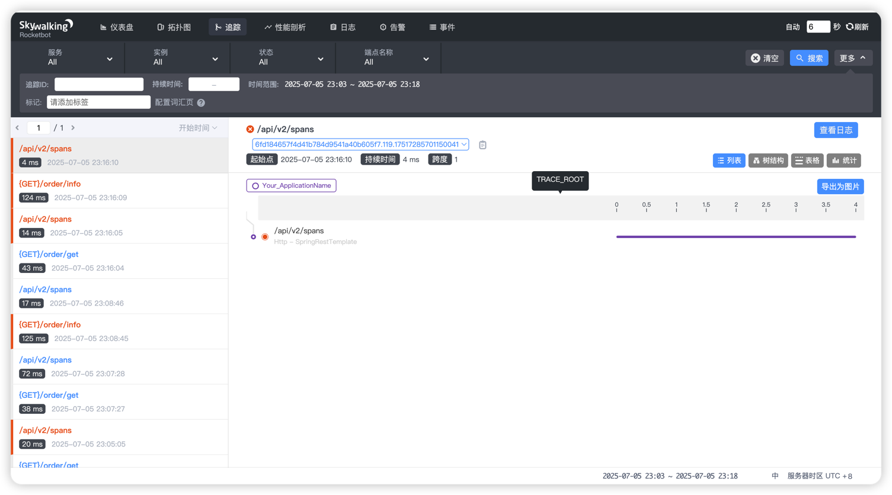

# 前言
本文采用版本: `skywalking 8.7.0`说明，不同的版本可能存在差异，在本文档编写的时候已经出现了**10**版本。

## 部署skywalking 服务端
直接进入bin目录执行`./startup.sh`即可启动服务，需要注意端口12800和8080，这是skywalking默认设置端口，保证没有被其他应用占用，8080是UI的端口。
## 启动agent
skywalking 采用无侵入式的agent架构，不需要添加任何依赖，只需要在jar程序启动的时候通过参数指定skywalking-agent.jar即可，SpringBoot类型应用启动如下：
```js
java  -javaagent:/Users/liuxin/Desktop/mouse-cloud-env/apache-skywalking-apm-bin870/agent/skywalking-agent.jar  -jar mouse-order.jar
```
- skywalking-agent.jar: 这个jar来自下载的skywalking发布包目录文件夹下。
- 还可以通过 -Dserver.port=8090 指定Boot应用的端口。

注意：一开始的时候打开监控界面是没有数据的，当第一次发起请求的时候会将服务等信息上报到skywalking服务端。

