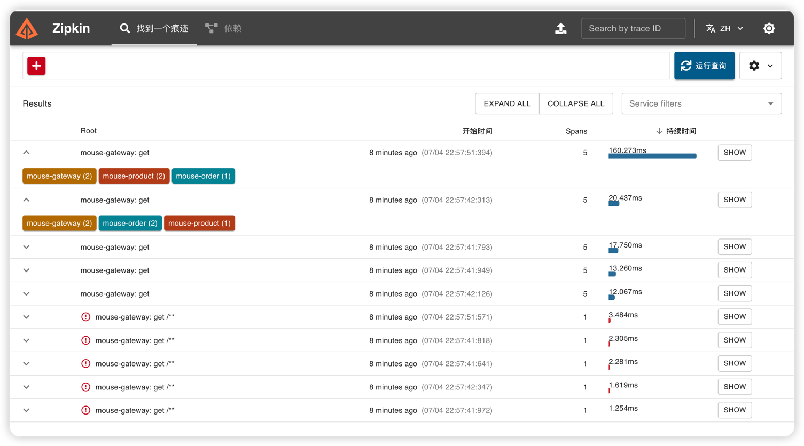

# 前言
 
 
## 整合过程

1、首先需要启动zipkin服务端用于收集链路信息，启动方式有多种，可以直接去官网下载jar直接运行，也可以通过docker运行，在默认情况下zipkin的管理界面端口是9411,同时
该端口也是与微服务进行通信的端口，链路信息通过与该端口建立连接进行上报。

2、需要在每个微服务添加如下依赖
```js
<dependency>
    <groupId>org.springframework.cloud</groupId>
    <artifactId>spring-cloud-starter-zipkin</artifactId>
    <version>2.2.8.RELEASE</version>
</dependency>
```
下面是zipkin相关的配置，默认情况下可以不用配置，只有需要进行自定义或者优化的时候才配置，入门时可以直接跳过。
```yml
spring:
  zipkin:
    base-url: http://localhost:9411/
```
